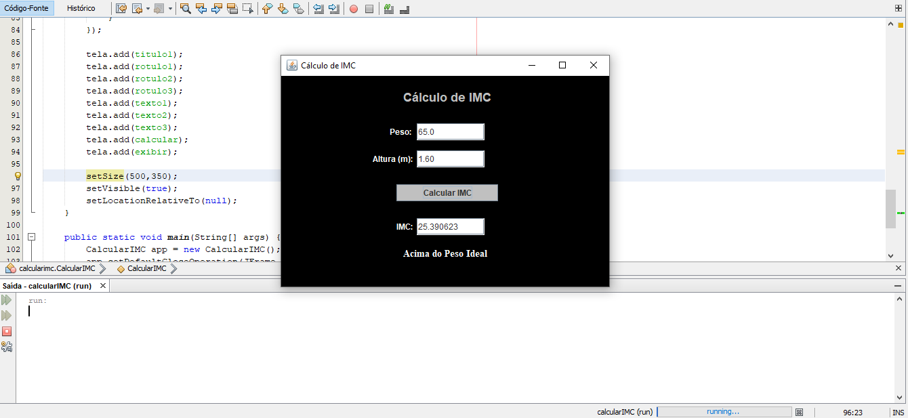
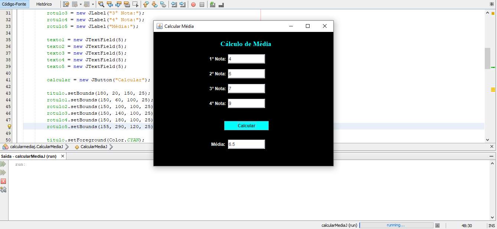
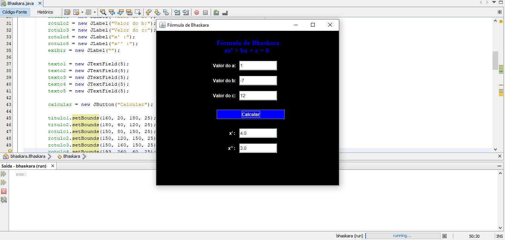
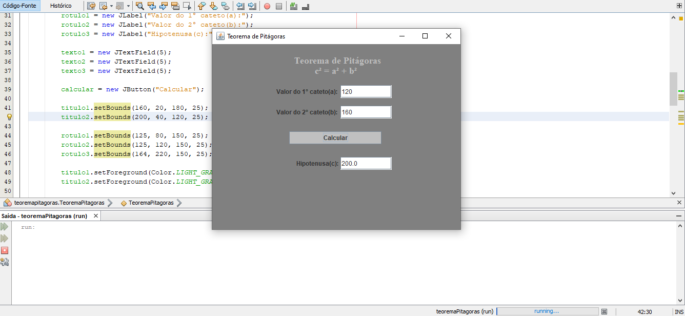
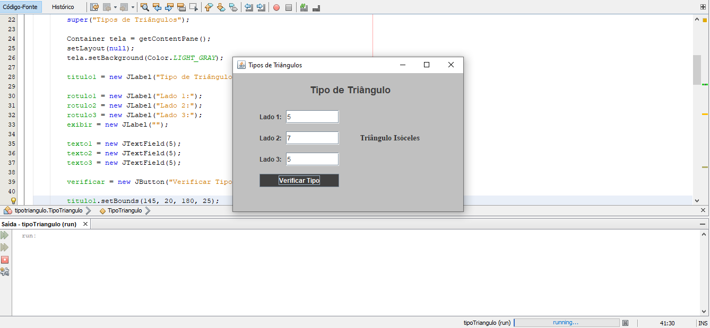
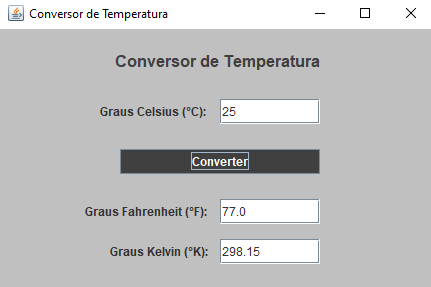

# JFrame Projects
JFrame projects made for treining. 

• Programa com interface gráfica que exiba uma tela de [cadastro de cliente](https://github.com/mariacpeixoto/JFrame-projects/blob/master/src/Projects/CadastroDeCliente.java).

• Programa com interface gráfica que faça as 4 [operações matemáticas básicas](https://github.com/mariacpeixoto/JFrame-projects/blob/master/src/Projects/CalculadoraJ.java) e retorne o resultado.

• Programa com interface gráfica que [calcule o IMC](https://github.com/mariacpeixoto/JFrame-projects/blob/master/src/Projects/CalcularIMC.java) e retorne o resultado.

• Programa com interface gráfica que calcule 4 notas fornecidas pelo usuário e exiba a [média](https://github.com/mariacpeixoto/JFrame-projects/blob/master/src/Projects/CalcularMediaJ.java) das notas.

• Programa com interface gráfica que calcule a [fórmula de Bhaskara](https://github.com/mariacpeixoto/JFrame-projects/blob/master/src/Projects/Bhaskara.java).

• Programa com interface gráfica que calcule o [teorema de Pitágoras](https://github.com/mariacpeixoto/JFrame-projects/blob/master/src/Projects/TeoremaPitagoras.java).

• Programa com interface gráfica que receba as medidas dos lados de um triângulo e indique seu [tipo](https://github.com/mariacpeixoto/JFrame-projects/blob/master/src/Projects/TipoTriangulo.java) e retorne o resultado.

• Programa com interface gráfica que faça a [conversão de temperatura](https://github.com/mariacpeixoto/JFrame-projects/blob/master/src/Projects/ConversorTemp.java) em graus celsius para fahrenheit e kelvin.

<h3>👨‍💻 Used Technology</h3>

- [Java](https://www.zup.com.br/blog/java#:~:text=O%20Java%20%C3%A9%20uma%20linguagem,como%20o%20pai%20do%20Java.)

<!--License session-->
<h3>📝 License</h3>

- This project is under [MIT](./LICENSE.txt) license.

<!--Bottom session-->
 <h4 align=center>Made with by <a target="_blank" href="https://github.com/mariacpeixoto" >Maria Peixoto</a></h4>
