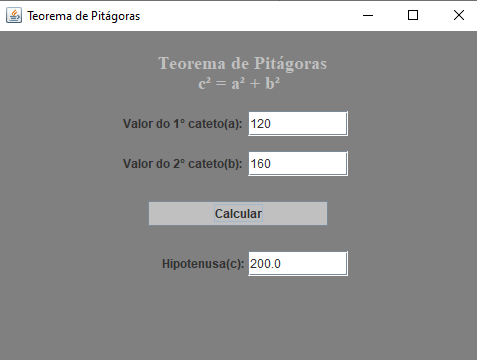

# JFrame Projects
JFrame projects made for treining. 

• [Customer registration](https://github.com/mariacpeixoto/JFrame-projects/blob/master/src/Projects/CadastroDeCliente.java): Graphical interface program that displays a customer registration screen.

• [Basic math operations](https://github.com/mariacpeixoto/JFrame-projects/blob/master/src/Projects/CalculadoraJ.java): Graphical interface program that solves the 4 basic math operations and returns the result.

• [BMI calculation](https://github.com/mariacpeixoto/JFrame-projects/blob/master/src/Projects/CalcularIMC.java): Graphical interface program that calculates the BMI and returns the result.

• [Average calculation](https://github.com/mariacpeixoto/JFrame-projects/blob/master/src/Projects/CalcularMediaJ.java): Graphical interface program that calculates 4 grades provided by the user and displays the average grades.

• [Bhaskara formula](https://github.com/mariacpeixoto/JFrame-projects/blob/master/src/Projects/Bhaskara.java): Graphical interface program that calculates Bhaskara's formula.

• [Pythagorean theorem](https://github.com/mariacpeixoto/JFrame-projects/blob/master/src/Projects/TeoremaPitagoras.java): Graphical interface program that calculates the Pythagorean theorem and returns the value of the hypotenuse.

• [Triangle Type](https://github.com/mariacpeixoto/JFrame-projects/blob/master/src/Projects/TipoTriangulo.java): Graphical interface program that receives the measurements of the sides of a triangle, indicates its type and returns the result.

• [Temperature Converter](https://github.com/mariacpeixoto/JFrame-projects/blob/master/src/Projects/ConversorTemp.java): Graphical interface program that converts temperature in degrees celsius to fahrenheit and kelvin.

<h3>👨‍💻 Used Technology</h3>

- [Java](https://www.zup.com.br/blog/java#:~:text=O%20Java%20%C3%A9%20uma%20linguagem,como%20o%20pai%20do%20Java.)

<!--License session-->
<h3>📝 License</h3>

- This project is under [MIT](./LICENSE.txt) license.

<!--Bottom session-->
 <h4 align=center>Made with by <a target="_blank" href="https://github.com/mariacpeixoto" >Maria Peixoto</a></h4>
